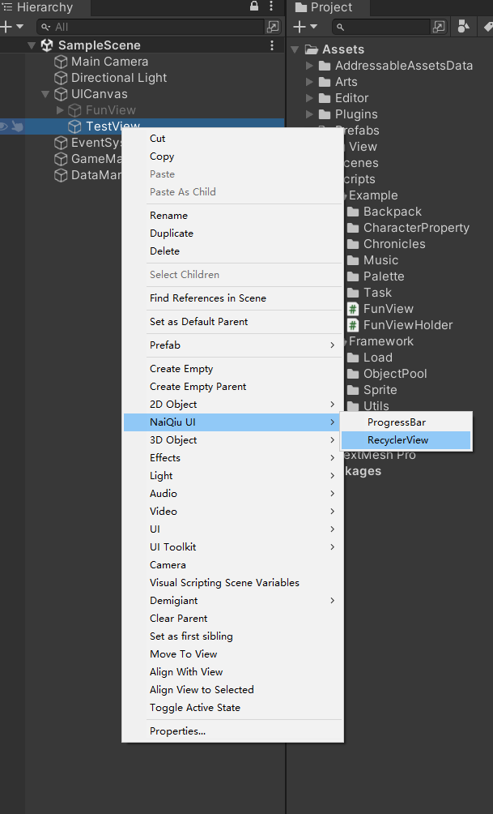
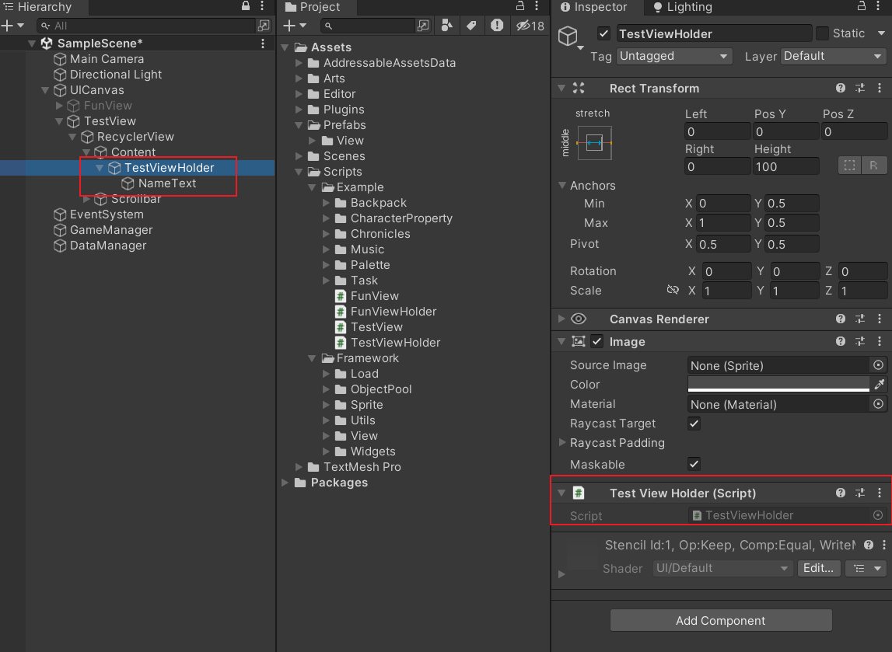
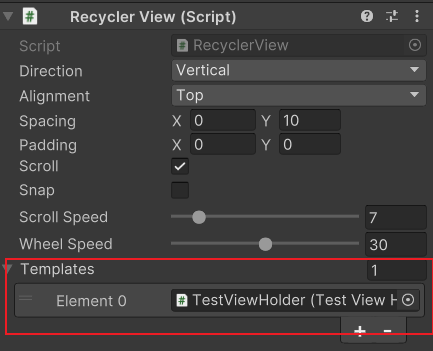
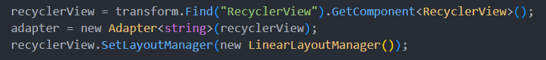
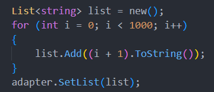

## RecyclerView，UGUI列表解决方案
### 使用教程
1. 在画布中右键 NaiQiu UI -> RecyclerView（也可以自己创建同样结构的 UI，类似于 UGUI 的 ScrollView），RecyclerView 暴露了很多常用的字段，可以在编辑器中调整；

2. 创建业务相关的 ViewHolder 视图，并编写对应的 ViewHolder 类，类需要继承 ViewHolder； 将 ViewHolder 视图作为预制件拖入到 RecyclerView 的 Templates 字段中；

3. 在代码中查找到 RecyclerView，初始化 Adapter，为 ReclcyerView 设置 LayoutManger；

4. 为Adapter设置数据，列表就会显示出来了。

### 更多用法
1. 滚动到某一个 Item
> RecyclerView.ScrollTo(index, smooth);
2. 在列表末尾添加 Item
> Adapter.Add(item);
3. 在列表末尾添加多个 Item
> Adapter.AddRange(collection);
4. 在列表任意位置插入一个 Item
> Adapter.Insert(index, item);
5. 在列表任意位置插入多个 Item
> Adapter.InsertRange(index, collection);
6. 移除列表中的一个 Item
> Adapter.Remove(item);
7. 移除列表中某个位置的 Item
> Adapter.RemoveAt(index);
8. 移除列表中的多个 Item
> Adapter.RemoveRange(index, count);
9. 移除列表中满足条件的 Item
> Adapter.RemoveAll(match);
10. 清空整个列表
> Adapter.Clear();
11. 反转列表的某一段
> Adapter.Reverse(index, count);
12. 反转整个列表
> Adapter.Reverse();
13. 列表排序
> Adapter.Sort(comparison);

其实可以看出来，以上对列表的操作都是通过对 Adapter 内部 list 的包装。

### 项目已实现的 LayoutManager
1. LinearLayoutManger

线性布局管理器，应该是使用最频繁的布局管理器，将列表水平或垂直依次排放。

2. GridLayoutManager

网格布局管理器，将列表切为横竖的表格，适用于背包之类的需求。

3. MixedLayoutManager

复合布局管理器，可以支持多种不同类型的 Item，当只有一种类型的 Item 时，其表现就和 LinearLayoutManager 一样。但如果你确定只需要使用一种 Item 时，
请优先选择 LinearLayoutManager，因为 MixedLayoutManager 需要计算不同 Item 的宽高，当列表长度成千上万条时，其性能明显低于 LinearLayoutManager。

4. PageLayoutManager

页面布局管理器，可以用来实现广告图翻页效果，为此特意在 RecyclerView 中添加的吸附效果。

5. CircleLayoutManager

圆形布局管理器，需要搭配 CircleScroller 使用，用来实现圆盘形布局。

6. 理论上来说，这套框架可以支持任意形式的布局情况，如果你有任何新奇的想法，就来尝试吧。

### 框架结构
### RecyclerView
框架核心类，负责整个框架的初始化，并暴露业务操作接口给开发者。
### Adapter
适配器，用于连接 Data 和 View。若是对数据有特殊要求，可以继承此类来处理，例如，MixedAdapter 通过包装数据实现多样式列表。Adapter 提供了数据处理的能力，
支持点击和选中状态的回调，需要对应的 ViewHolder 添加了 Button 组件。
### LayoutManager
布局管理器，负责设置 ViewHolder 的位置。本身是抽象类，提供了丰富的接口可供扩展，可以通过继承它来实现各种各样的的布局样式，可以在这里添加动画效果。
### Scroller
滚动器，负责处理滚动相关的内容，本身只支持水平或垂直滚动，可以通过继承来实现特殊的滚动需求。Scroller 可以根据列表长度来决定是否启用 Scrollbar。
### ViewProvider
ViewHolder 提供器，拥有创建和管理 ViewHolder 的能力。内部使用了对象池，ViewHolder 的创建和销毁不会消耗额外性能。目前框架中支持两种 ViewProvider，
分别是支持一种 ViewHolder 的 SimpleViewProvider 和支持多种 ViewHolder 的 MixedViewProvider。
### ViewHolder
抽象类，使用此框架必须要实现它的子类。一般情况下，我们也只需要实现这个类即可。拥有自己的生命周期，最好不要使用 Mono 的生命周期回调。